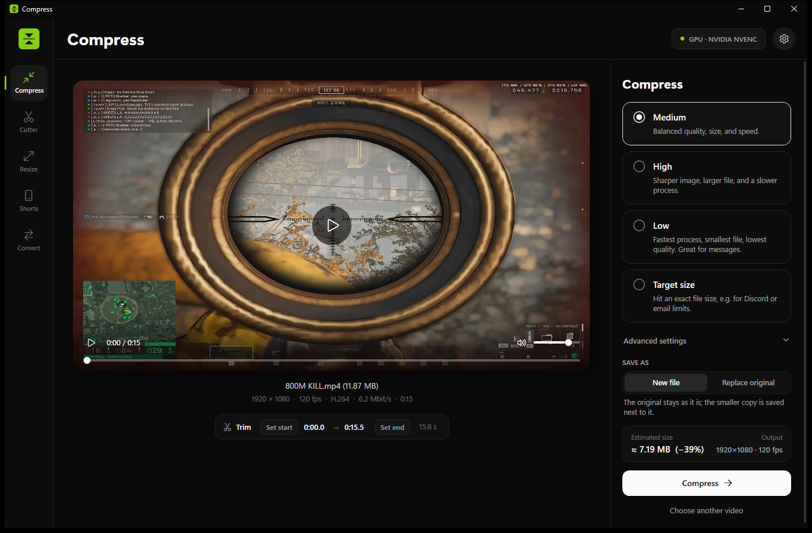
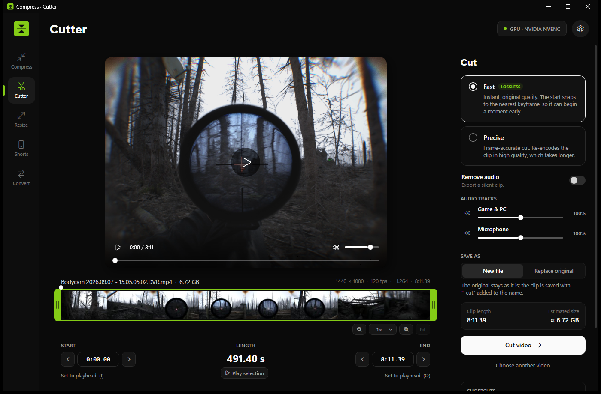
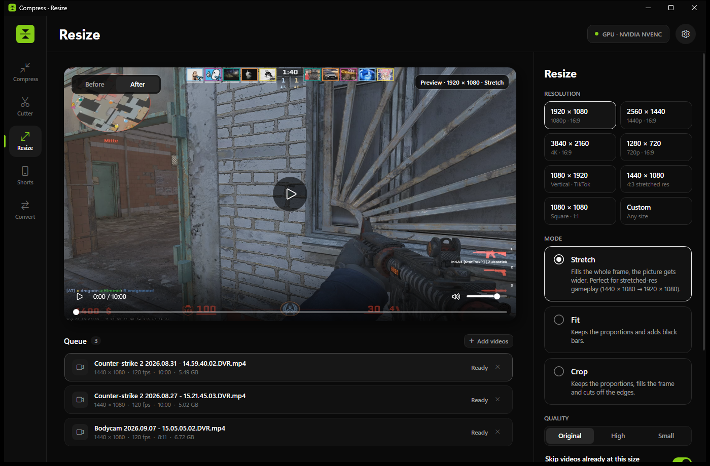
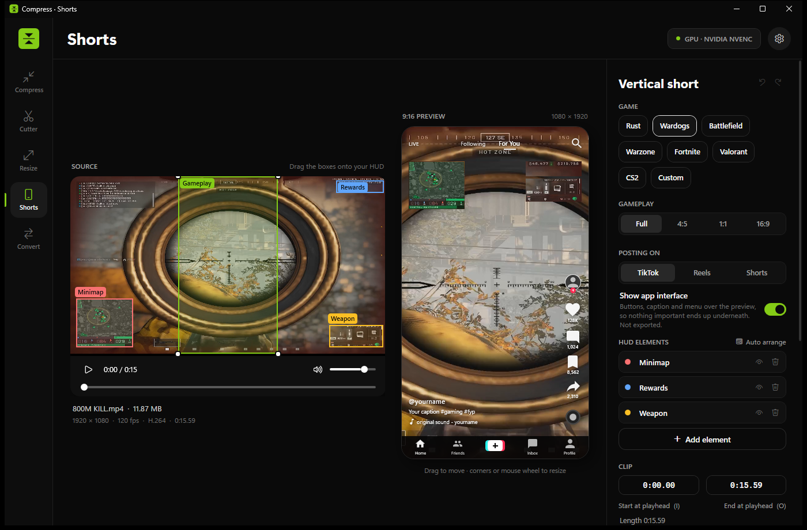
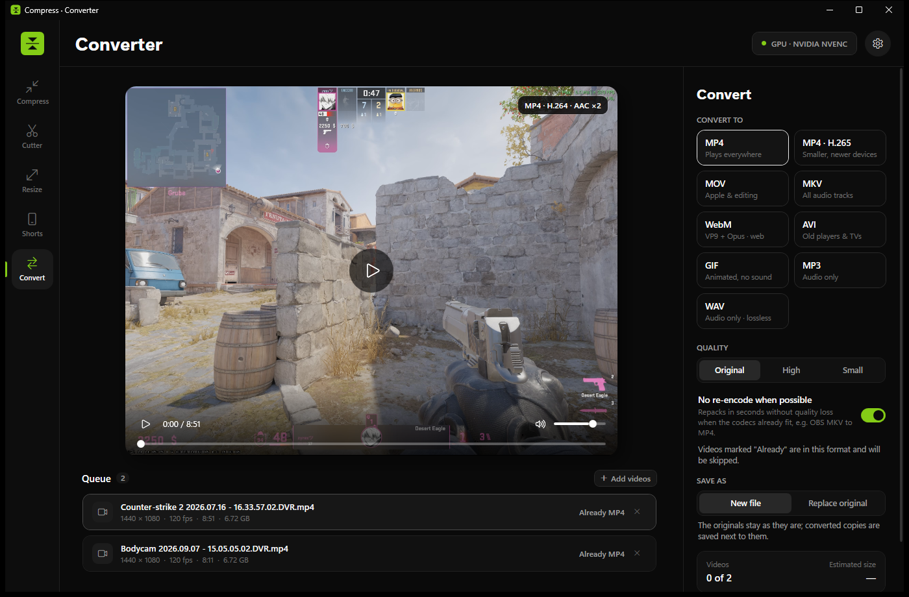

<div align="center">


# Compress

**The all-in-one video toolkit for gamers on Windows.**
Shrink clips for Discord, cut them without quality loss, fix stretched resolutions,
turn gameplay into TikTok / Reels / Shorts with your HUD intact, and convert between formats.
Local, fast and GPU-accelerated.

[](https://github.com/sasuke559/compress/releases/latest/download/Compress-win-x64.zip)
&nbsp;
[](https://github.com/sasuke559/compress/releases/latest)




</div>

---

## Why Compress?

Game clips straight out of the NVIDIA app, OBS or Medal are huge, often recorded at a stretched resolution, have the game and your microphone on separate audio tracks, and are the wrong shape for TikTok. Fixing that usually means three different programs. Compress does all of it in one window, in a few clicks, without uploading anything.

- **Private:** everything runs on your PC. No account, no upload, no watermark.
- **Fast:** hardware encoding on NVIDIA (NVENC), AMD (AMF) and Intel (Quick Sync), lossless stream copy wherever possible.
- **Made for gaming clips:** 120 fps footage, stretched 4:3 resolutions, separate game/mic tracks and game HUDs are handled out of the box.

## Features

### Compress: Discord-ready in seconds
- Quality presets (**High / Medium / Low**) or an exact **target size** (e.g. 10 MB for Discord, 25 MB, 50 MB).
- Never produces a file bigger than the original: bitrate caps plus an automatic size-limited second pass.
- H.264 or H.265, optional resolution (1080p / 720p / 480p) and frame-rate (60 / 30 fps) limits, trim before compressing.
- Before/after toggle to compare the result with the original.

### Cutter: cut the moment, lossless


- Filmstrip timeline with draggable start/end handles, frame-by-frame nudging and **zoom** (mouse wheel, `+` / `-`, zoom menu).
- **Fast** mode cuts by stream copy (instant, original quality); **Precise** mode re-encodes for frame-accurate starts.
- **Per-track audio:** mute or adjust *Game & PC* and *Microphone* separately, heard live in the preview.

### Resize: stretched res, fixed


- Batch-convert to any resolution: **Stretch** (e.g. 1440×1080 stretched res → 1920×1080), **Fit** (black bars) or **Crop**.
- Live before/after preview of exactly what the export will look like; skips videos that are already the right size.

### Shorts: 16:9 → 9:16 with your HUD


- Turns landscape gameplay into a **1080×1920** vertical video for TikTok, Instagram Reels and YouTube Shorts.
- Cuts out HUD elements (minimap, health, ammo, kill feed…) and places them in the vertical frame. Presets for Rust, Wardogs, Battlefield, Warzone, Fortnite, Valorant and CS2, or build your own.
- Optional overlay of the app's buttons and caption, so nothing important ends up hidden behind them.
- **Subtitles at the push of a button**: turns what you say into big TikTok-style captions with the spoken word highlighted. Speech recognition ([Whisper](https://github.com/ggerganov/whisper.cpp)) runs on your PC, nothing is uploaded. Pick the language and whether to listen to your mic or all audio, fix any word before exporting, place the captions at the top, middle or bottom. The speech model (190 MB) is downloaded the first time.

### Convert: any format, zero hassle


- **MP4, MP4 (H.265), MOV, MKV, WebM, AVI, GIF, MP3, WAV**, as a batch.
- Repackages without re-encoding when the codecs already fit, e.g. an OBS **MKV → MP4** in a fraction of a second, without any quality loss.

### And also
- **Separate audio tracks** (NVIDIA app "separate tracks", OBS multi-track) are mixed into one track, so Discord and phones play game *and* voice, or kept separate for editing.
- **New file or replace original:** keep the original, or let the result take its place (the original goes to the Recycle Bin).
- Phone videos (portrait `.MOV` from iPhone/Android) are previewed and exported upright.
- Drag & drop, batch queues, taskbar progress, and *Copy file* to paste the result straight into Discord.

## Download & install

1. Download **[Compress-win-x64.zip](https://github.com/sasuke559/compress/releases/latest/download/Compress-win-x64.zip)** from the [latest release](https://github.com/sasuke559/compress/releases/latest).
2. Unzip it anywhere (e.g. `C:\Tools\Compress`).
3. Run **`Compress.exe`**.

No installer, no .NET runtime needed, and FFmpeg is included, so it works offline. Requires Windows 10 or 11 (64-bit).

> **Windows SmartScreen:** because the app is new and not code-signed, Windows may show *"Windows protected your PC"*. Click **More info → Run anyway**.

## Keyboard shortcuts

| Keys | Action |
|---|---|
| `Ctrl` + `1` … `5` | Switch page (Compress, Cutter, Resize, Shorts, Convert) |
| `Ctrl` + `O` | Open video(s) |
| `Space` | Play / pause |
| `I` / `O` | Set start / end at the playhead |
| `←` / `→` | Seek back / forward |
| `,` / `.` | One frame back / forward (Cutter) |
| Mouse wheel · `+` / `-` · `0` | Zoom the Cutter timeline · `0` shows the whole video |
| `Shift` + mouse wheel | Scroll the zoomed timeline |

## Building from source

**Requirements:** Windows 10/11 and the [.NET 10 SDK](https://dotnet.microsoft.com/download), or Visual Studio 2026 with the *.NET desktop development* workload.

```powershell
git clone https://github.com/sasuke559/compress.git
cd compress

# run in debug
dotnet run --project Compress

# build the portable release (single-file exe)
dotnet publish Compress/Compress.csproj -c Release -r win-x64 --self-contained true `
  -p:PublishSingleFile=true -p:IncludeNativeLibrariesForSelfExtract=true `
  -p:EnableCompressionInSingleFile=true -p:PublishReadyToRun=true -p:DebugType=none -o dist
```

Releases are signed: the app only installs updates whose `Compress.exe.sig` matches the public key in `Core/Updater.cs`. Sign a build with `dotnet run tools/sign-release.cs -- sign dist/Compress.exe` (the private key stays in `%USERPROFILE%\.compress`, see the script) and upload `Compress.exe`, `Compress.exe.sig` and the zip to the release.

Feedback and the anonymous usage counters go to a small Cloudflare Worker in [`server/`](server), which forwards them to Discord. The Discord webhook URLs are Worker secrets and never ship in the app.

A source build looks for `ffmpeg.exe` / `ffprobe.exe` next to the app, in an `ffmpeg` sub-folder, in `%LOCALAPPDATA%\Compress\ffmpeg` or on the `PATH`. If none is found, the app offers to download it on first start.

### Project structure

```
Compress/
├── App.xaml(.cs)          startup, global error handler (writes crash.log)
├── MainWindow.xaml(.cs)   shell: sidebar, header, settings, drag & drop
├── Pages/                 Compress, Cutter, Resize, Shorts, Convert
├── Controls/              video player, timeline helpers, drop zone, dropdowns
├── Core/                  FFmpeg engine (job planning & execution), settings,
│                          Shorts layouts, preview helpers
└── Themes/Theme.xaml      colors and control styles
docs/                      logo and screenshots for this README
```

Built with **C# / WPF on .NET 10** and **[FFmpeg](https://ffmpeg.org)**.

## FAQ

**Where are my settings?** In `%LOCALAPPDATA%\Compress\settings.json`.

**How do I report a bug or suggest an idea?** Click **Feedback** in the top-right corner of the app. Write what happened or what you would like, and click **Send**. The report goes straight to the developer, no account needed. Optional system info (app and Windows version, FFmpeg, GPU encoders, last error) helps fixing bugs.

**The app says something went wrong.** Click **Yes** to report it. The error details from `%LOCALAPPDATA%\Compress\crash.log` are sent along when *Include system info* is on.

**How do I update?** Compress checks GitHub for a new version when it starts. It downloads the update in the background and shows **Restart to update** in the header; the new version also starts the next time you open the app. Turn it off in **Settings → Updates**. Versions before 1.0.3 have to be updated once by hand.

**Are updates safe?** Every update is signed by the developer, and Compress refuses files without a valid signature, even if they come from the official download page. If a new version ever fails to start, Compress goes back to the previous one by itself and skips that update.

**Does Compress collect data?** Only anonymous counts: that the app was installed, that it was used on a day (once a day at most), and how many videos each tool exported, plus the app version. No ID, no file names, no IP addresses are stored. Turn it off in **Settings → Privacy**.

**Does it upload my videos anywhere?** No. All processing happens locally with FFmpeg.

## License

© 2026 sasuke559. All rights reserved. The source code is published for reference; please ask before reusing it.

The release download bundles **FFmpeg** ([BtbN build](https://github.com/BtbN/FFmpeg-Builds)), which is licensed under the **GNU GPL v3**; its license text and source links are included in the `ffmpeg` folder of the download. The app runs FFmpeg as a separate program. Subtitles use [Whisper.net](https://github.com/sandrohanea/whisper.net) and [whisper.cpp](https://github.com/ggerganov/whisper.cpp) (MIT, see `LICENSE-whisper.txt` in the download).
